# ForoHub


Proyecto para el desarrollo de un Foro, sabemos para qué sirve el foro y conocemos su aspecto, ¿pero sabemos cómo funciona detrás de escena? Es decir, ¿dónde se almacenan las informaciones? ¿Cómo se tratan los datos para relacionar un tópico con una respuesta, o cómo se relacionan los usuarios con las respuestas de un tópico?

## Indice

El proyecto consta de los siguiente pasos y están disponibles en la sección adyacente:

1. [Requerimientos](#requerimientos)
2. [Estructura Proyecto](#estructura-proyecto)
3. [Docker](#docker)
4. [Migrations](#migrations)
5. [API](#api)
6. [Consumo API](#consumo-api)
7. [Manejo Respuestas](#manejo-respuestas)
8. [Spring Security y JWT](#spring-security-y-jwt)
9. [Consideraciones](#consideraciones)

## Requerimientos

El proyecto nace como un forma de demostrar la capacidades de elegir las librerias, la organización y bien implementar una solución para la obtención de información para la conversion de monedas.

| Recursos               | Información                                   |
|------------------------|-----------------------------------------------|
| Eclipse Temurin JDK 17 | https://adoptium.net/es/temurin/releases/     |
| Spring Boot 3.3.1      | https://maven.apache.org/            |
| Maven Project 4.0.0    | https://maven.apache.org/            |
| Project lombok 1.18.30 | https://projectlombok.org/setup/maven         |
| MariaDB 10.5           | https://mariadb.com/kb/en/mariadb-server-10-5/         |
| Flywaydb               | https://flywaydb.org/         | 
| Java JWT 4.2           | https://github.com/auth0/java-jwt        | 
| ModelMapper 3.2.0      | https://modelmapper.org         | 
| GitHub                 | https://github.com/jjoaquin3/ConversorMonedas |

Estos serian los principales, las otras libreria se pueden encontrar en pom.xml del API

## Estructura Proyecto

Estructura principal del proyecto
```plaintext
├──src
│   ├───main
│      ├───java
│      │   └───com
│      │       └───jjoaquin3
│      │           └───forohub
│      │               ├───config
│      │               ├───controller
│      │               ├───model
│      │               │   └───dto
│      │               ├───repository
│      │               ├───service
│      │               │   └───impl
│      │               └───util
│      └───resources
│          ├───db
│              └───migration
├──docker-db              
```

- controller: Divide la comunciación entre el usuario y la logica de negocio.
- service: Capa logica que gestion realiza las operaciones en este caso seria usar los parámetros que recibe el controller y sus respuestas
- repository: Capa que permite las operaciones y comunicación con la DB
- model: Represtanción de las entidades tanto para request, reponse o bien entidades.
- conf: Tiene los auxiliares, en este caso un para security
- resources: Para establecer configuraciones generales y comportamientos del aplicativo, tambien los archivos para la migración con flyway
- docker-db: Archivo para aprovisionar un contenedor que albergara la DB

## Docker

Para el desarrollo se configuro una instancia de docker con MariaDB que pueda servir como la DB

* Se observa el uso de variables de entorno ya sea crear un .env o las variables que se le indique
``` yml
version: '3.10'

services:
  mysql:
    container_name: FOROHUB_CONTAINER
    build:
      context: .
      dockerfile: dockerfile
    image: forohub_mariadb
    environment:
      MYSQL_ROOT_PASSWORD: ${ROOT_MYSQL_PASSWORD}
      MYSQL_DATABASE: ${FOROHUB_MYSQL_DATABASE}
      MYSQL_USER: ${FOROHUB_MYSQL_USER}
      MYSQL_PASSWORD: ${FOROHUB_MYSQL_PASSWORD}
    ports:
      - "3306:3306"
    volumes:
      - mysql_data:/var/lib/mysql
      - ./BaseDatos.sql:/docker-entrypoint-initdb.d/BaseDatos.sql
      - ./init_db.sh:/docker-entrypoint-initdb.d/init_db.sh

volumes:
  mysql_data:
```

* dockerfile: carga archivos para us configuración inicial siendo estos para creación de usuarios y configuración case sensitive
``` shell
FROM mariadb:10.5

COPY BaseDatos.sql /docker-entrypoint-initdb.d/
COPY init_db.sh /docker-entrypoint-initdb.d/
``` 

* init_db.sh: realiza la creación DB, usuario y permisos para la DB especifica
``` shell
#!/bin/bash
set -e

# Verificar que las variables de entorno estén configuradas
if [ -z "$MYSQL_ROOT_PASSWORD" ] || [ -z "$MYSQL_DATABASE" ] || [ -z "$MYSQL_USER" ] || [ -z "$MYSQL_PASSWORD" ]; then
  echo "Falta alguna variable de entorno requerida. Asegúrate de que todas las variables estén configuradas."
  exit 1
fi

# Ejecutar comandos SQL
mysql -u root -p"${MYSQL_ROOT_PASSWORD}" <<-EOSQL
  CREATE DATABASE IF NOT EXISTS ${MYSQL_DATABASE};
  CREATE USER IF NOT EXISTS '${MYSQL_USER}'@'%' IDENTIFIED BY '${MYSQL_PASSWORD}';
  GRANT ALL PRIVILEGES ON ${MYSQL_DATABASE}.* TO '${MYSQL_USER}'@'%';
  FLUSH PRIVILEGES;
EOSQL
``` 

* BaseDatos.sql: Si por alguna razon no se crea la DB la crea con esta opcion tambien, este archivo puede servir para incializar una migración tambien 
``` sql
CREATE SCHEMA IF NOT EXISTS FOROHUB_DB;
USE FOROHUB_DB;
```

* my.cnf: Configuración cargada por el dockerfile para el tema de case sensitive 
``` sh
[mysqld]
lower_case_table_names=0
``` 

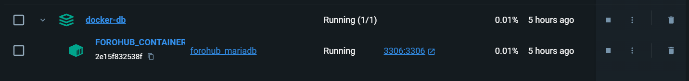

## Migrations

Con el uso de FlyWay se relizan las migración con los archivos colocados en resources.db.migration

* pom.xml
``` xml
 <dependency>
    <groupId>org.flywaydb</groupId>
    <artifactId>flyway-core</artifactId>
</dependency>
<dependency>
    <groupId>org.flywaydb</groupId>
    <artifactId>flyway-mysql</artifactId>
</dependency>
```
* resources.db.migration.V2__inserts-dummy.sql: ha mas archivos pero respetar el doble barra baja para que pueda detectarse
``` sql
-- Inserts COURSE
INSERT INTO `COURSE` (`category`, `name`)
VALUES
('Programming', 'Java Basics'),
('Web Development', 'HTML/CSS Fundamentals'),
('Data Science', 'Introduction to Machine Learning'),
('Design', 'Graphic Design Principles'),
('Business', 'Entrepreneurship 101');
``` 
* La DB guardando el history de flyway
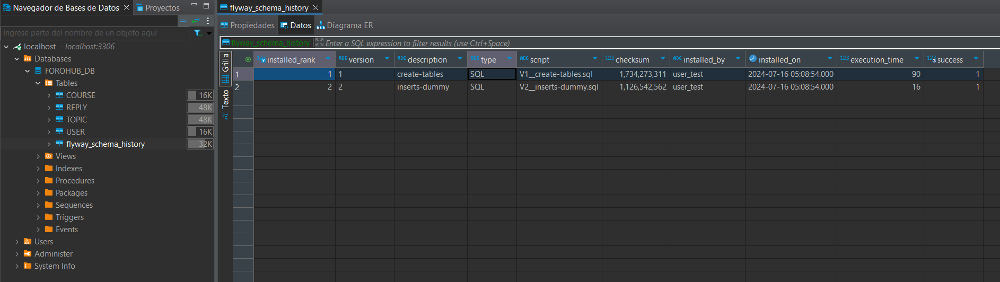

## API

#### **Validacion**

* Sa hace uso de valid para asegurar los campos.
``` xml
<dependency>
    <groupId>org.springframework.boot</groupId>
    <artifactId>spring-boot-starter-validation</artifactId>
</dependency>
```

* Por ejemplo en el controller
``` java
//01. Registro de un nuevo topico
@PostMapping
public ResponseEntity<TopicResponseDTO> save(@RequestBody @Valid TopicRequestDTO request)
{
    var topic = topicService.save(request);
    var uri = UriComponentsBuilder.fromPath("/{id}").buildAndExpand(topic.getId()).toUri();
    return ResponseEntity.created(uri).body(topic);
}
```
#### **Consumo API**

01. Registro de un nuevo topico
<div style="text-align: center;">
    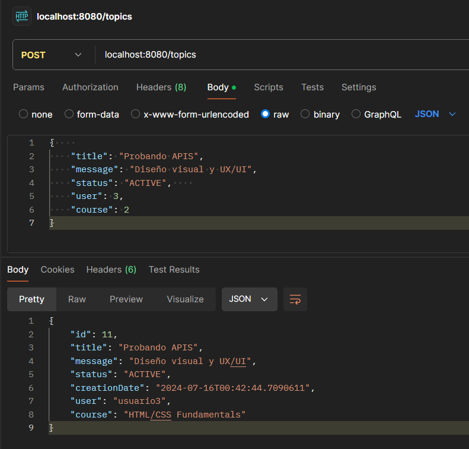
</div>

02. Mostrar todos los tópicos
<div style="text-align: center;">
    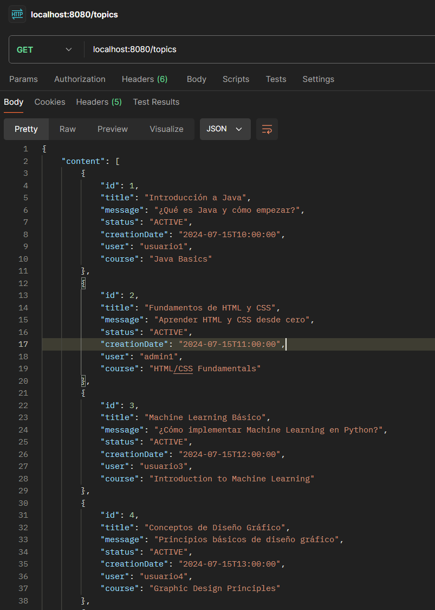
</div>

03. Mostrar topic por ID
<div style="text-align: center;">
    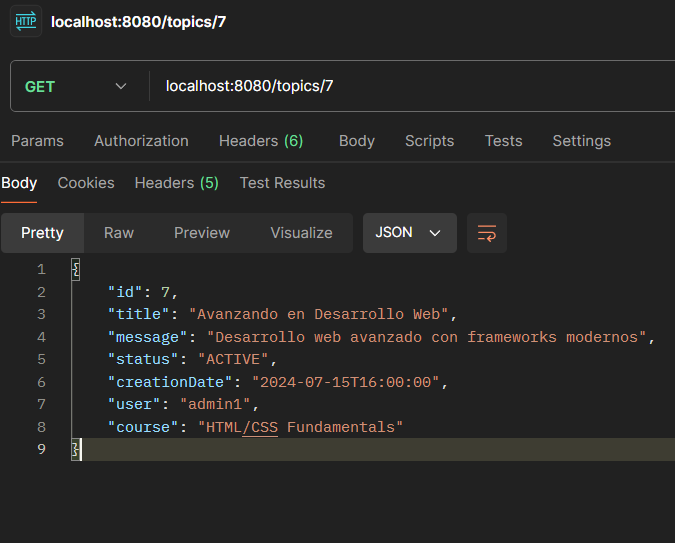
</div>

04. Actualizar topic
<div style="text-align: center;">
    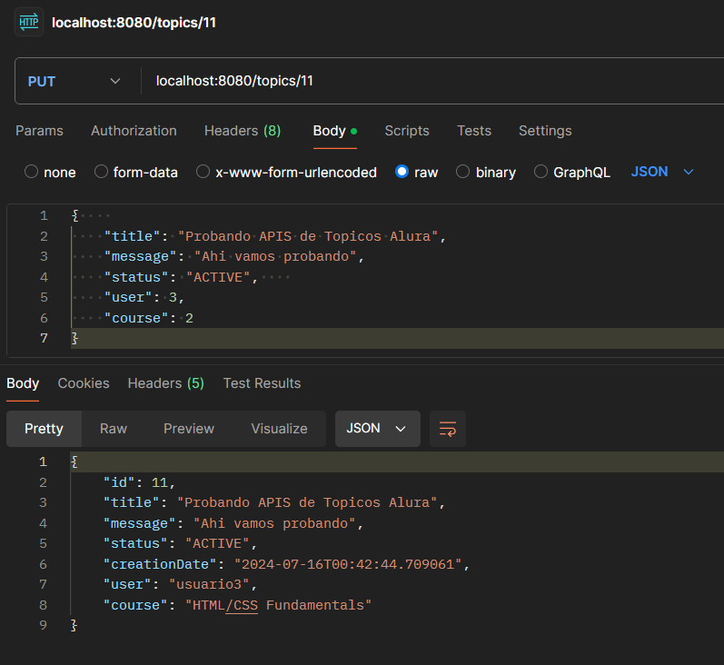
</div>

05. Eliminar topic
<div style="text-align: center;">
    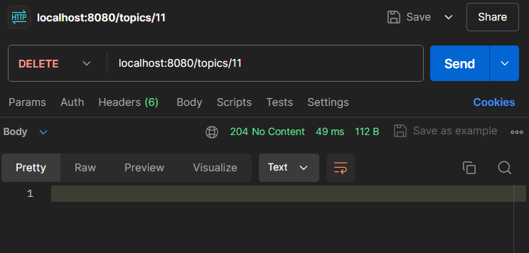
</div>

## Manejo Respuestas

#### **DTOS**

Se hace uso 2 dtos para Response y Request con el fin de limitar los valores que se pueden compartir

```java
@JsonIgnoreProperties(ignoreUnknown = true)
public record TopicRequestDTO(

        @NotBlank
        String title,

        @NotBlank
        String message,

        @NotBlank
        String status,

        /*Seria el id de usuario pero yo lo guardo asi con el nombre de la tabla c:*/
        @NotNull
        Long user,

        /*Seria el id de course pero yo lo guardo asi con el nombre de la tabla c:*/
        @NotNull
        Long course
) {}
```

```java
@JsonIgnoreProperties(ignoreUnknown = true)
public class TopicResponseDTO
{
    private Long id;

    private String title;

    private String message;

    private String status;

    private LocalDateTime creationDate;
    /*
    @Column(name = "answers", nullable = true)
    private Integer countReplies;
    */

    private String user;

    private String course;

    public TopicResponseDTO(Topic entity)
    {
        this.id = entity.getId();
        this.title = entity.getTitle();
        this.message = entity.getMessage();
        this.status = entity.getStatus();
        this.creationDate = entity.getCreationDate();
        this.user = entity.getUser().getUsername();
        this.course = entity.getCourse().getName();
    }
}
```
## Spring Security y JWT

Se configura Spring Security para forzar iniciar sesión y obtener Token con JWT y poder hacer uso de los endpoint (aunque actualmente estan solo los de Topic xD)

* Actualizando dependencias
``` xml
<dependency>
    <groupId>org.springframework.boot</groupId>
    <artifactId>spring-boot-starter-security</artifactId>
</dependency>

<dependency>
    <groupId>org.springframework.security</groupId>
    <artifactId>spring-security-test</artifactId>
    <scope>test</scope>
</dependency>

<dependency>
    <groupId>com.auth0</groupId>
    <artifactId>java-jwt</artifactId>
    <version>4.2.1</version>
</dependency>
```

* Endpoint para autenticar usuario: en el cual se obtiene con información de usuario y password el token JWT
``` java
@RestController
@RequestMapping("/login")
public class AuthController
{
    private final AuthenticationManager authenticationManager;
    private final TokenService tokenService;

    @Autowired
    public AuthController(AuthenticationManager authenticationManager, TokenService tokenService)
    {
        this.authenticationManager = authenticationManager;
        this.tokenService = tokenService;
    }

    @PostMapping
    public ResponseEntity authenticateUser(@RequestBody @Valid UserRequestDTO userRequestDTO)
    {
        var authToken = new UsernamePasswordAuthenticationToken(userRequestDTO.getUsername(), userRequestDTO.getPassword());
        var authUser = authenticationManager.authenticate(authToken);
        var jwtToken = tokenService.getToken((User) authUser.getPrincipal());
        return ResponseEntity.ok(new JWTTokenDTO(jwtToken));
    }
}
```

* Filtrado de accesos: en el cual login con verbo post esta abierto para que se puedan obtener el token y utilizarlo en los otros verbos y paths
``` java
@Bean
    public SecurityFilterChain securityFilterChain(HttpSecurity http) throws Exception
    {
        return http.csrf(AbstractHttpConfigurer::disable)
            .sessionManagement(session -> session.sessionCreationPolicy(SessionCreationPolicy.STATELESS))
            .authorizeHttpRequests
            (
                authorize -> authorize
                    .requestMatchers(HttpMethod.POST, "/login")
                        .permitAll()
                    /*.requestMatchers(HttpMethod.GET)
                    .permitAll()*/
                    .anyRequest()
                    .authenticated()
            )
            .addFilterBefore(securityFilter, UsernamePasswordAuthenticationFilter.class)
            .build();
    }
```

01. Login y obtener token
<div style="text-align: center;">
    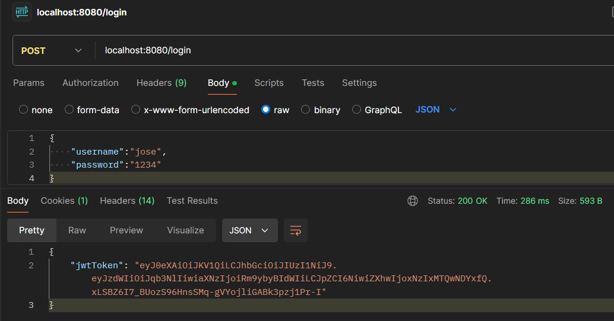
</div>

02. Mostrar todos los tópicos (usando token)
<div style="text-align: center;">
    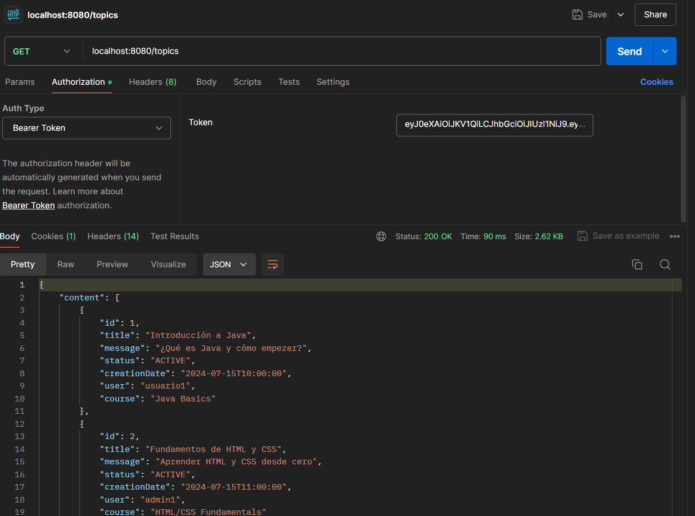
</div>

03.  Mostrar todos los tópicos (sin usar token) = error 403
<div style="text-align: center;">
    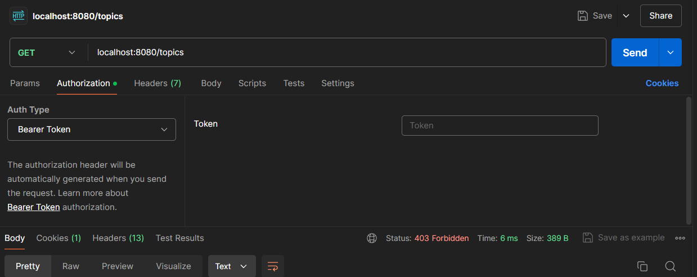
</div>

04. Crear Topic (usando token)
<div style="text-align: center;">
    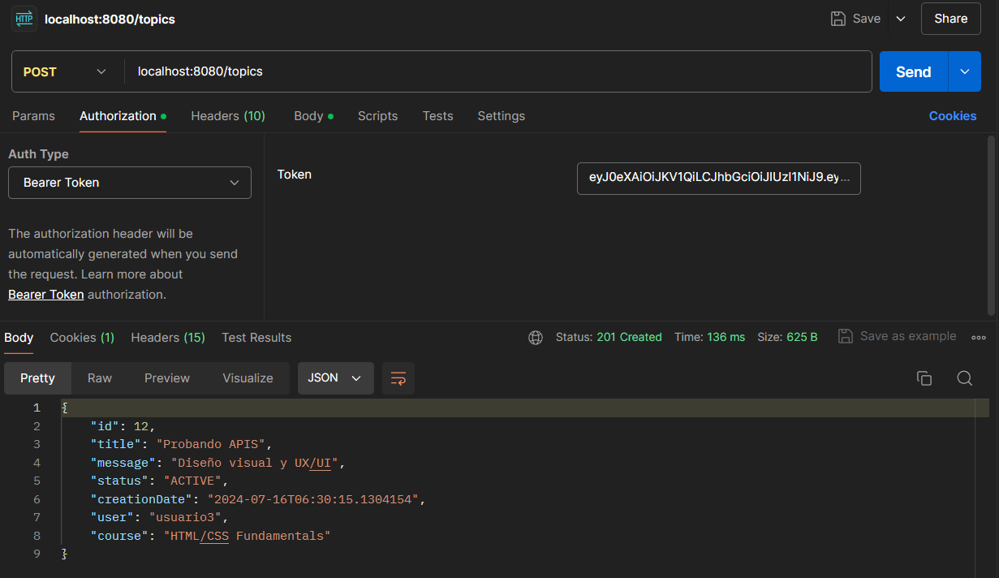
</div>


## Consideraciones

- Actualente la API contiene el CRUD para la entidad de TOPIC

### Próximas Actualizaciones

- Implementación de Respuestas de otras entidades
- Manejo de Roles y permisos por rol
- y mas 


Fin c:

